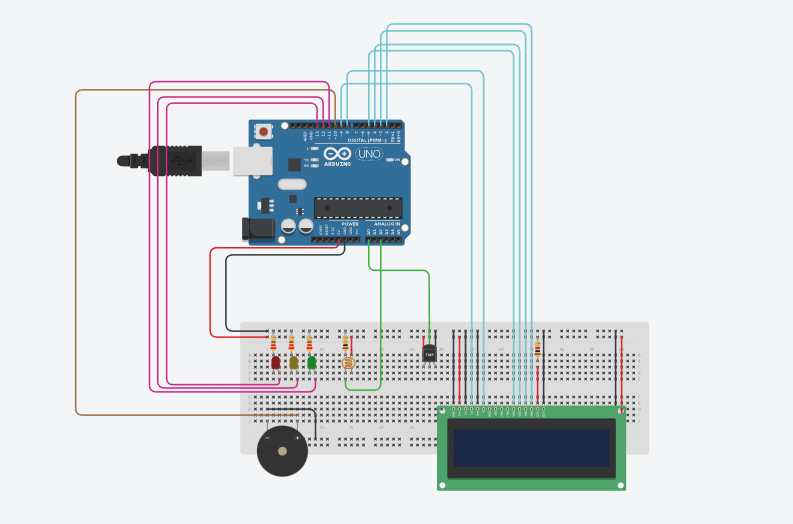
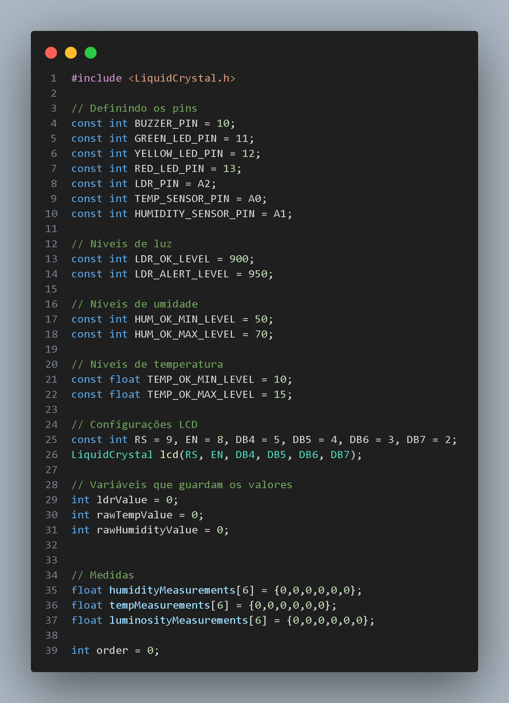
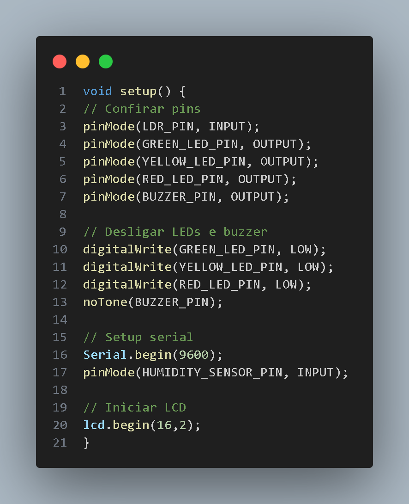
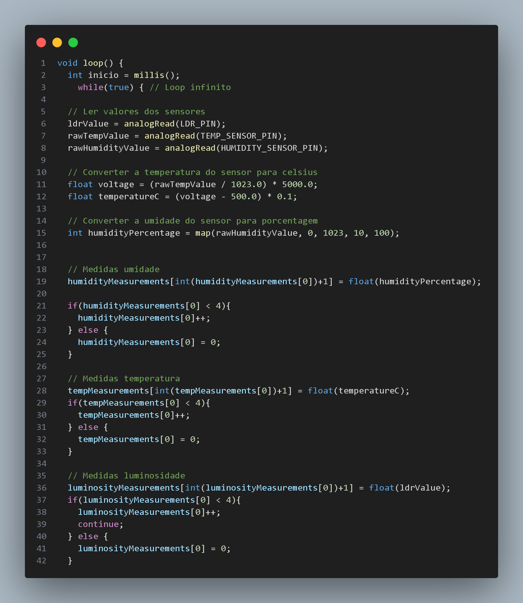
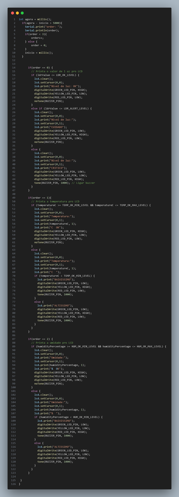

# Winery Sensors Arduino 🍷

Alunos:
<ul>
<li>André Nakamatsu Rocha (RM 555004)</li>
<li>Caio Suzano Ferreira Da Silva (RM 554763)</li>
<li>Matheus Rivera Montovaneli (RM 555499)</li>
<li>Lucas Vasquez Silva (RM 555159)</li>
<li>Guilherme Linard F. R. Gozzi (RM 555768)</li>
</ul>
 

# O Projeto 📝
O projeto baseia-se em um sistema para monitorar a luminosidade, temperatura e umidade de uma vinícola usando um LDR e o DHT11. Alertando por meio de LED's e som se caso o limite de luz, temperatura e umidade exceder ou estar menor que o recomendado.
 

<a href="https://www.tinkercad.com/things/4S3AE9gJQzp-cp02-edge-computing/editel?sharecode=vOLCiUOaUEslPjI7DB_9dx8rPn29b88FDNGAlhl7aZw">Link do Projeto</a>

## Componentes Necessários 🔨
- 1 Arduino UNO
- 1 LED Vermelho
- 1 LED Amarelo
- 1 LED Verde
- 3 Resistores 220 Ω
- 1 Resistor 10 kΩ
- 1 Resistor 1 kΩ
- 1 Fotoresistor
- 1 Potenciômetro
- 1 Sensor de Temperatura (TMP36)
- 1 Buzzer
- 1 LCD 16x2
- 29 Fios de conexão

# O Código 📄
Primeiro iniciamos definindo os pins e constantes que usaremos:

Após isso, configuramos todos os pins, desligamos os LEDs e iniciamos o LCD

Começando o código, lemos os valores de todos os sensores, convertemos os valores para os valores corretos e declaramos as medidas.

Finalizando, analisamos a ordem que o LCD está, mudando caso necessário e printamos todas as informações para o LCD, ascendendo os LED's e o Buzzer nas situações ideais.

